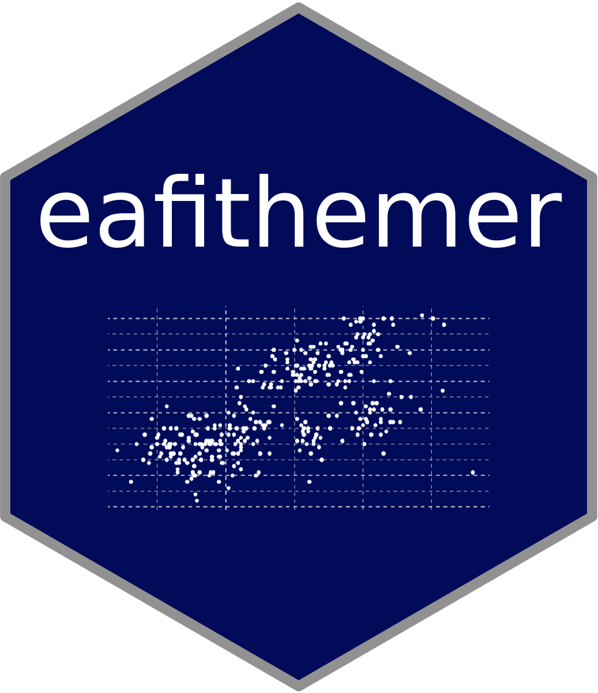

<!-- README.md is generated from README.Rmd. Please edit that file -->

```{r, include = FALSE}
knitr::opts_chunk$set(
  collapse = TRUE,
  comment = "#>",
  fig.path = "man/figures/README-",
  out.width = "100%"
)
```

# eafithemer 

<!-- badges: start -->
[](https://www.tidyverse.org/lifecycle/#experimental)
[](https://www.gnu.org/licenses/gpl-3.0)
[](https://github.com/camilogarciabotero/eafithemer/actions)
[](https://doi.org/10.5281/zenodo.4526717)
<!-- badges: end -->

The goal of eafithemer is to provide a simple theme using EAFIT university instutional aesthetics.

## Installation

<!-- You can install the released version of eafithemer from [CRAN](https://CRAN.R-project.org) with: -->

<!-- ``` r -->

<!-- install.packages("eafithemer") -->

<!-- ``` -->

You can install the development version from [GitHub](https://github.com/) with:

``` r
install.packages("devtools")
devtools::install_github("camilogarciabotero/eafithemer")
```

## Examples

This is a basic example Showing the light template:

```{r theme-light, warning=FALSE, message=FALSE}
library(tidyverse)
library(palmerpenguins)
library(eafithemer)

palmerpenguins::penguins %>%
    ggplot2::ggplot(aes(bill_length_mm, flipper_length_mm)) +
  geom_point(aes(color = species)) +
  labs(
    title = "Little title",
    subtitle = "Testing the subtitle",
    caption = "First attempt on package creation"
  ) +
  eafithemer::theme_eafit_light() +
  eafithemer::scale_color_eafit() +
  theme(
    legend.title = element_blank()
  )
```

For dark template see:

```{r theme-dark, warning=FALSE, message=FALSE}
library(tidyverse)
library(palmerpenguins)
library(eafithemer)

palmerpenguins::penguins %>%
    ggplot2::ggplot(aes(bill_length_mm, flipper_length_mm)) +
  geom_point(aes(color = species)) +
  labs(
    title = "Little title",
    subtitle = "Testing the subtitle",
    caption = "First attempt on package creation"
  ) +
  eafithemer::theme_eafit_dark() +
  scale_color_brewer() +
  theme(
    legend.title = element_blank()
  )
```

# A glance into EAFIT palette

```{r palette-obj, include=F}
eafit_palette <- c(
  "#0F1114" #dark grey
  ,"#0E1526" #dark blue
  ,"#000359" #navy blue
  ,"#009BD0" #light blue
  ,"#459D96" #gray green
  ,"#404376" #purple blue
  ,"#4f5157" #darker blue/grey
  ,"#8A8A8A" #light grey
  ,"#FFFFFF" #white
)
```

```{r palette}
scales::show_col(eafit_palette)
```

# Citation
If you find this package useful, please consider the following citation! 

> Camilo García. (2021). eafithemer v1.0.0: a simple ggplot theme for EAFIT institution (Version v1.0.0). Zenodo. http://doi.org/10.5281/zenodo.4526717

# Credits

This package was highly based on [Ryo Nakagawara](https://github.com/Ryo-N7) [`tvthemes`](https://ryo-n7.github.io/tvthemes/) package.
