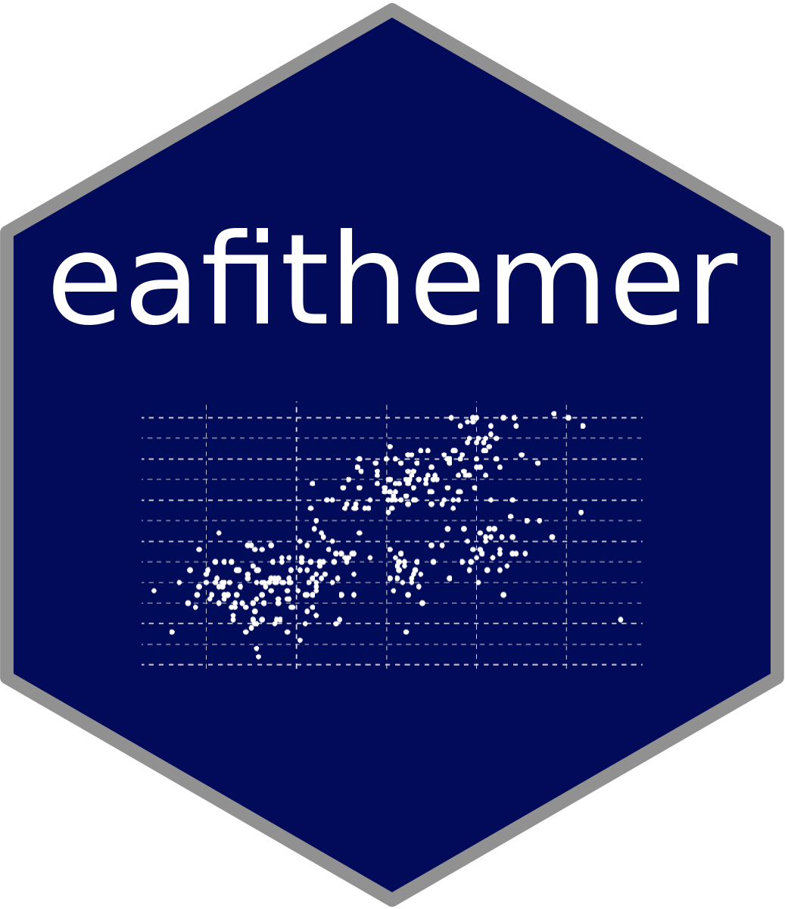
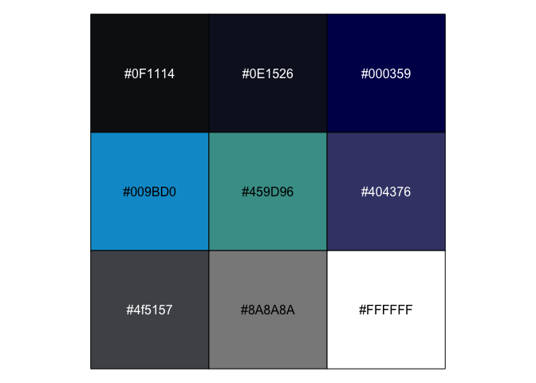

<!-- README.md is generated from README.Rmd. Please edit that file -->

# eafithemer 

<!-- badges: start -->

[](https://www.tidyverse.org/lifecycle/#experimental)
[](https://www.gnu.org/licenses/gpl-3.0)
[](https://github.com/camilogarciabotero/eafithemer/actions)
<!-- badges: end -->

The goal of eafithemer is to provide a simple theme using EAFIT
university instutional aesthetics.

## Installation

<!-- You can install the released version of eafithemer from [CRAN](https://CRAN.R-project.org) with: -->
<!-- ``` r -->
<!-- install.packages("eafithemer") -->
<!-- ``` -->

You can install the development version from
[GitHub](https://github.com/) with:

``` r
install.packages("devtools")
devtools::install_github("camilogarciabotero/eafithemer")
```

## Example

This is a basic example which shows you how to solve a common problem:

``` r
library(tidyverse)
library(palmerpenguins)
library(eafithemer)

palmerpenguins::penguins %>%
    ggplot2::ggplot(aes(bill_length_mm, flipper_length_mm)) +
  geom_point(aes(color = species)) +
  labs(
    title = "Little title",
    subtitle = "Testing the subtitle",
    caption = "First attempt on package creation"
  ) +
  eafithemer::theme_eafit_light() +
  eafithemer::scale_color_eafit() +
  theme(
    legend.title = element_blank()
  )
```


``` r
library(tidyverse)
library(palmerpenguins)
library(eafithemer)

palmerpenguins::penguins %>%
    ggplot2::ggplot(aes(bill_length_mm, flipper_length_mm)) +
  geom_point(aes(color = species)) +
  labs(
    title = "Little title",
    subtitle = "Testing the subtitle",
    caption = "First attempt on package creation"
  ) +
  eafithemer::theme_eafit_dark() +
  scale_color_brewer() +
  theme(
    legend.title = element_blank()
  )
```


# A glance into EAFIT palette

``` r
scales::show_col(eafit_palette)
```



# Credits

This package was highly based on [Ryo
Nakagawara](https://github.com/Ryo-N7)
[`tvthemes`](https://ryo-n7.github.io/tvthemes/) package.
